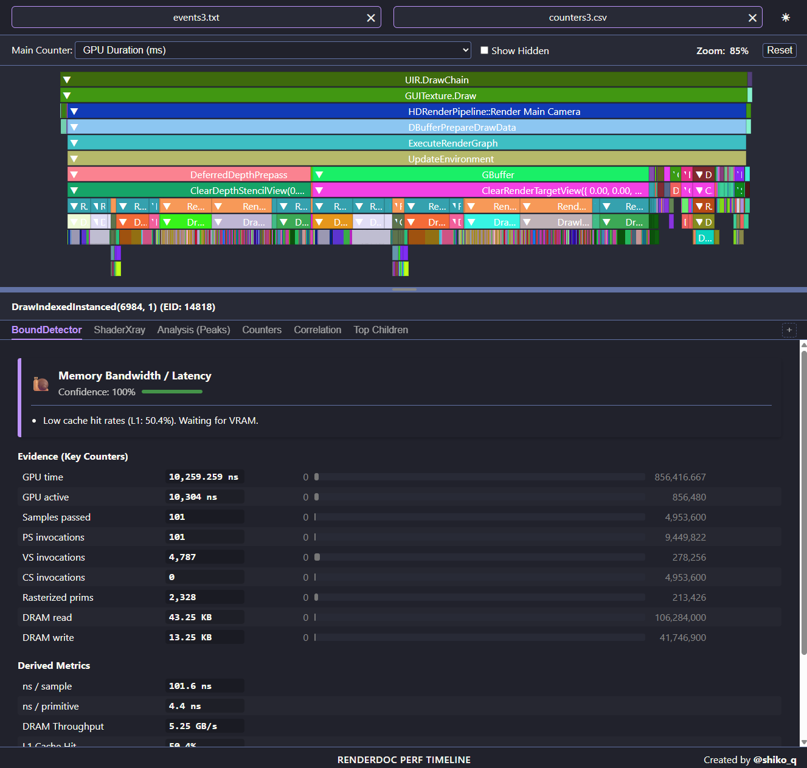

# RenderDoc Perf Timeline

A visualization tool for RenderDoc performance counters. It transforms flat CSV data into an interactive, hierarchical timeline, helping quickly identify gpu bottlenecks and shader stalls.

## Features

- **Hierarchical Timeline:** View your draw calls nested by markers, exactly like in RenderDoc.
- **Dynamic Scaling:** Blocks' widths are relative to the selected counter (Duration, Samples, etc.).
- **Plugin System:** Extend functionality with custom JavaScript plugins.
- **Advanced Diagnostics:**
  - **BoundDetector:** Evidence-based guessing of whether you are bound by Math, Memory, ROP, or Frontend.
  - **ShaderXray:** Deep dive into NVIDIA Warp Stalls to understand *why* a shader is slow.
- **Zero Installation:** Single HTML file. No server required. Works entirely in your browser.

## How to Use

### 1. Export Data from RenderDoc
To visualize your capture, you need two files:

1.  **Events Hierarchy:** 
    - In the **Event Browser**, right-click and select **Export to TXT** - 💾.
    - Save it as `events.txt`.
2.  **Performance Counters:**
    - Open the **Performance Counter Viewer**.
    - Select your counters (NVIDIA Perf SDK counters recommended for advanced plugins).
    - Click **Capture Counters**.
    - Click **Save to CSV** - 💾.
    - Save it as `counters.csv`.

### 2. Visualize
- Open `RenderDocPerfTimeline.html` in any modern browser.
- Drag & Drop `events.txt` and `counters.csv` into the respective header zones.
- Load plugins (`BoundDetector.js`, `ShaderXray.js`) by dragging them into the plugin area or using the **+** button.

### 3. Quick Start with Examples
The repository includes `events.txt` and `counters.csv` which you can use as sample data to test the tool and its plugins immediately.

## Included Plugins

### **BoundDetector**
Analyzes global medians and per-event metrics to provide a "Diagnosis Card". It tells you if a draw call is likely limited by geometry complexity, pixel throughput, memory latency, or ALU pressure.

### **ShaderXray**
Specifically designed for NVIDIA GPUs. It breaks down "Warp Issue Stalls" (Long Scoreboard, Math Throttle, Tex Throttle, etc.) and provides concrete optimization advice based on the dominant stall reason.

---
**Created by [@shiko_q](https://t.me/shiko_q)** 